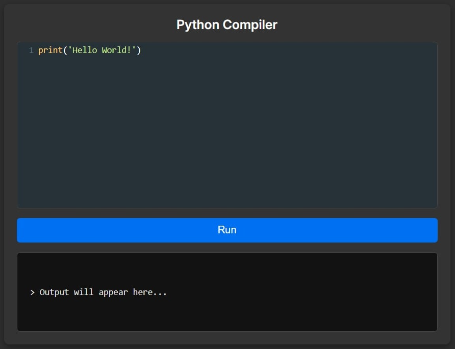

# Simple Python Compiler

A web-based Python compiler that allows you to write, run, and test Python code directly in your browser. Built with modern web technologies, it provides a professional coding experience with syntax highlighting, real-time execution, and user input handling.

## 🖼️ Screenshot

